# Hi, I'm Guangguo Deng

  

  

  
  
  

## Embedded Dashboard

### System Profile

| Channel | Signal |
| :--- | :--- |
| **MCU / Core** | `STM32`, `ARM Cortex-M`, `ARMv7/v8 A-Series` |
| **RTOS** | `FreeRTOS`, `RT-Thread` |
| **Drivers** | `UART`, `I2C`, `SPI`, `CAN`, `RS485`, `Ethernet` |
| **Toolchains** | `Keil MDK`, `IAR`, `STM32CubeIDE`, `Git`, `Docker` |
| **Languages** | `C`, `C++`, `Python`, `ASM` |

### Current Focus

- **Project-Sentinel**: hardware, firmware, and gateway protocol integration.
- Building reusable driver libraries for STM32 and Cortex-M platforms.
- Writing embedded design notes from real development practice.

## Core Toolchain

  
  
  
  
  
  

## GitHub Signals

  

## Contact

  

